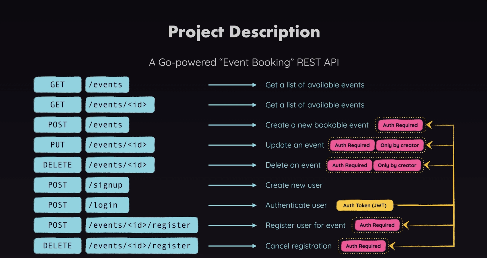

# Project Description

A Go-powered "Event Booking" REST API

```sh
GET /events # Get a list of available events
``` 

```sh
GET /events/<id> # Get a list of available events
````

```sh
POST /events # Create a new bookable event `Auth Required`
````

```sh
PUT /events/<id> # Update an event `Auth Required` `Only by creator`
```

```sh
DELETE /events/<id> # Delete an event `Auth Required` `Only by creator`
```

```sh
POST /signup # Create a new user
```

```sh
POST /login # Authenticate user `Auth Token (JWT)`
```

```sh
POST /events/<id>/register # Register user for event `Auth Required`
```

```sh
DELETE /events/<id>/register # Cancel registration `Auth Required`
```